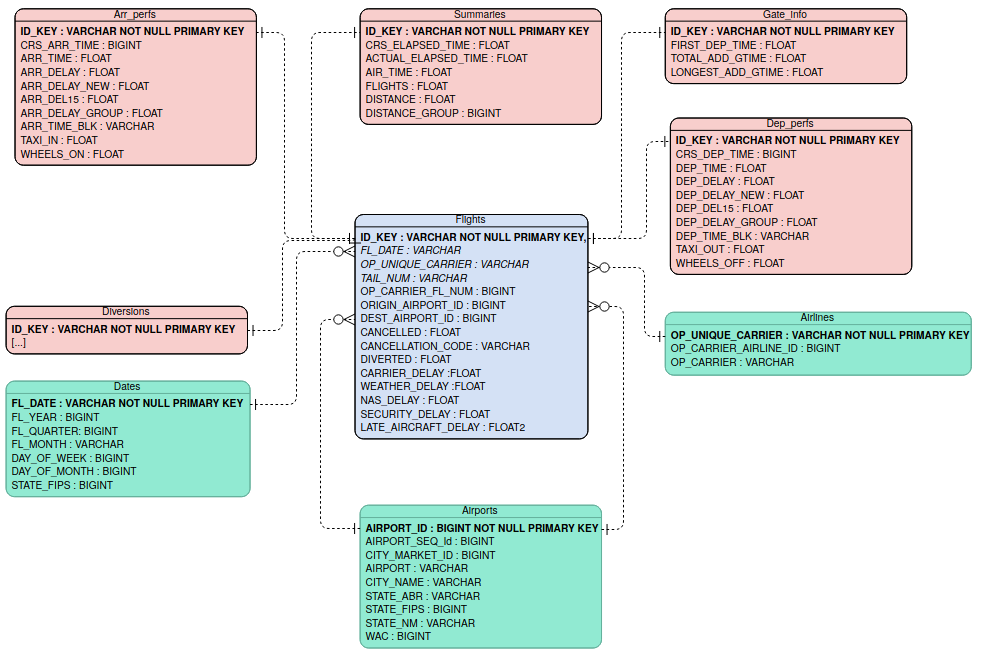
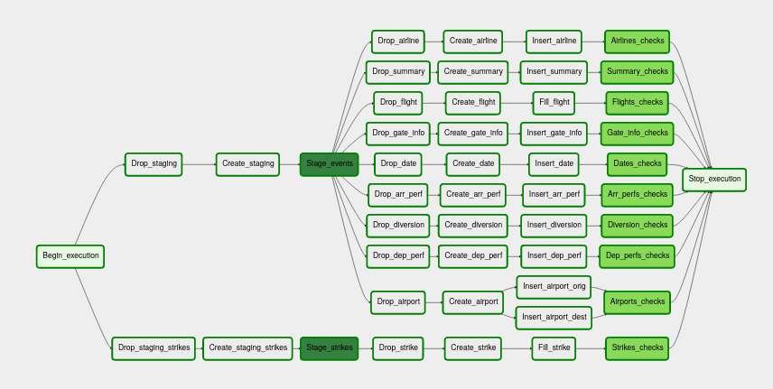

# Flights DB

The scope of this repo is to construct a pipeline (in airflow) that creates a DB (on a redshift cluster) containing information about US flights and strikes in 2019, to perform monthly analyses on  correlation between flight delays and strikes.

Using airflow allows to automatise the pipeline. As it is, the pipeline is executed monthly. Simple changes in the configuration would allow to execute it on a daily basis.

## Dataset
Data on flights are obtained from the [Bureau of Transportation Statistics](https://www.transtats.bts.gov/DL_SelectFields.asp?Table_ID=236&DB_Short_Name=On-Time). Data on strikes are obtained from the [Bureau of Labor Statistics](https://beta.bls.gov/labs/). Both these websites allow to download data for a specific year and month, and to select the required information. 

Both websites provide a .csv file that is stored in the s3 bucket ```s3://demographics-udacity/```, in the folders ```airports/``` and ```strikes``` respectively. Each file in the ```airports``` folder correspond to a month. E.g. ```s3://demographics-udacity/airports/1.csv``` corresponds to January 2019.

## Files 
The following files are needed for execution:
1. ```airflow/dags/capstone.py``` defines the DAG and the pipeline. Relies on the operators defined in the ```operators``` folder
2. ```airflow/plugins/operators``` folder containing the operators used in the DAG:
-  ```stage_redshift.py``` stages the data from S3  into redshift
- ```data_quality.py``` runs the data check query passed as argument and compares its record with the expected one. If they differ, it raises an error
3. ```airflow/plugins/helpers/sql_queries.py``` contains the SQL queries loaded in ```dags/capstone.py``` and used for deleting, creating and filling the fact and dimension tables.


## Database Schema
The data on flights are stored in a Database organised in a star schema, in which however not all of the periferic tables are dimension tables. This schema is optimized on the queries of the analytics department, which are mostly focused on delays depending on airports and carriers. The database contains the following tables
#### Fact Table dictionary
1. **flights** 


| column         | type       | description | 
| ------------- |:-------------:| :-------------:| 
| ID_KEY (PRIMARY KEY)| VARCHAR| Flight identifier|
| FL_DATE|VARCHAR | Flight date|
| OP_UNIQUE_CARRIER|VARCHAR | Unique Carrier Code. When the same code has been used by multiple carriers, a numeric suffix is used for earlier users, for example, PA, PA(1), PA(2). Use this field for analysis across a range of years.	|
| TAIL_NUM|VARCHAR | Tail Number|
| OP_CARRIER_FL_NUM|BIGINT |Flight Number |
| ORIGIN_AIRPORT_ID|BIGINT | Origin Airport, Airport ID. An identification number assigned by US DOT to identify a unique airport. Use this field for airport analysis across a range of years because an airport can change its airport code and airport codes can be reused.	|
| DEST_AIRPORT_ID| BIGINT| Destination Airport, Airport ID. An identification number assigned by US DOT to identify a unique airport. Use this field for airport analysis across a range of years because an airport can change its airport code and airport codes can be reused.	|
| CANCELLED| FLOAT| Cancelled Flight Indicator (1=Yes)|
| CANCELLATION_CODE|VARCHAR | Specifies The Reason For Cancellation|
|  DIVERTED|  FLOAT|  Diverted Flight Indicator (1=Yes)|
|  CARRIER_DELAY|  FLOAT|  Carrier Delay, in Minutes|
|  WEATHER_DELAY|  FLOAT|  Weather Delay, in Minutes|
|  NAS_DELAY|  FLOAT|  National Air System Delay, in Minutes|
|  SECURITY_DELAY|  FLOAT|  Security Delay, in Minutes|
|  LATE_AIRCRAFT_DELAY| FLOAT |  Late Aircraft Delay, in Minutes|


#### Dimenson Tables dictionaries
1. **airports** 


| column         | type       | description | 
| ------------- |:-------------:| :-------------:| 
| AIRPORT_ID (PRIMARY KEY)| BIGINT|  Airport ID. An identification number assigned by US DOT to identify a unique airport. Use this field for airport analysis across a range of years because an airport can change its airport code and airport codes can be reused.|
| AIRPORT_SEQ_ID| BIGINT| Airport Sequence ID. An identification number assigned by US DOT to identify a unique airport at a given point of time. Airport attributes, such as airport name or coordinates, may change over time. |
| CITY_MARKET_ID|BIGINT | City Market ID is an identification number assigned by US DOT to identify a city market. Use this field to consolidate airports serving the same city market. |
| AIRPORT| VARCHAR| Airport|
| CITY_NAME| VARCHAR| City name|
| STATE_ABR| VARCHAR| State code|
| STATE_FIPS| BIGINT| State Fips|
| STATE_NM| VARCHAR| State name|
| WAC| BIGINT| World area code|

2. **airlines** 


| column         | type       | description | 
| ------------- |:-------------:| :-------------:| 
| OP_UNIQUE_CARRIER (PRIMARY KEY)| VARCHAR| Unique Carrier Code. When the same code has been used by multiple carriers, a numeric suffix is used for earlier users, for example, PA, PA(1), PA(2). Use this field for analysis across a range of years.	|
| OP_CARRIER_AIRLINE_ID| BIGINT| 	An identification number assigned by US DOT to identify a unique airline (carrier). A unique airline (carrier) is defined as one holding and reporting under the same DOT certificate regardless of its Code, Name, or holding company/corporation.	|
| OP_CARRIER|VARCHAR | Carrier |

3. **dates**


| column         | type       | description | 
| ------------- |:-------------:| :-------------:| 
| FL_DATE (PRIMARY KEY)| VARCHAR| Date|
| FL_YEAR| BIGINT| Year|
| FL_QUARTER| BIGINT| Quarter|
| FL_MONTH| VARCHAR| Month|
| DAY_OF_MONTH|BIGINT | Day of month|
| DAY_OF_WEEK| BIGINT| Day of week|

#### Other  Tables dictionaries
1. **dep_perfs**


| column         | type       | description | 
| ------------- |:-------------:| :-------------:| 
| ID_KEY (PRIMARY KEY)|VARCHAR | Flight identifier |
| CRS_DEP_TIME| BIGINT| CRS Departure Time (local time: hhmm)|
| DEP_TIME| FLOAT| Actual Departure Time (local time: hhmm)|
| DEP_DELAY| FLOAT| Difference in minutes between scheduled and actual departure time. Early departures show negative numbers.|
| DEP_DELAY_NEW| FLOAT| Difference in minutes between scheduled and actual departure time. Early departures set to 0.|
| DEP_DEL15| FLOAT| Departure Delay Indicator, 15 Minutes or More (1=Yes)|
| DEP_DELAY_GROUP| FLOAT| Departure Delay intervals, every (15 minutes from <-15 to >180)|
| DEP_TIME_BLK| VARCHAR| CRS Departure Time Block, Hourly Intervals|
| TAXI_OUT| FLOAT| Taxi Out Time, in Minutes|
| WHEELS_OFF| FLOAT| Wheels Off Time (local time: hhmm)|

2. **arr_perfs**


| column         | type       | description | 
| ------------- |:-------------:| :-------------:| 
| ID_KEY (PRIMARY KEY)|VARCHAR | Flight identifier |
| WHEELS_ON| FLOAT| Wheels On Time (local time: hhmm)|
| TAXI_IN| FLOAT| Taxi In Time, in Minutes|
| CRS_ARR_TIME|BIGINT | CRS Arrival Time (local time: hhmm)|
| ARR_TIME|FLOAT | Actual Arrival Time (local time: hhmm)|
| ARR_DELAY|FLOAT | Difference in minutes between scheduled and actual arrival time. Early arrivals show negative numbers.|
| ARR_DELAY_NEW|FLOAT | Difference in minutes between scheduled and actual arrival time. Early arrivals set to 0.|
| ARR_DEL15| FLOAT| Arrival Delay Indicator, 15 Minutes or More (1=Yes)|
| ARR_DELAY_GROUP|FLOAT | Arrival Delay intervals, every (15-minutes from <-15 to >180)|
| ARR_TIME_BLK| VARCHAR| CRS Arrival Time Block, Hourly Intervals|

3. **summaries**


| column         | type       | description | 
| ------------- |:-------------:| :-------------:| 
| ID_KEY (PRIMARY KEY)| VARCHAR| Flight identifier |
| CRS_ELAPSED_TIME| FLOAT| CRS Elapsed Time of Flight, in Minutes|
| ACTUAL_ELAPSED_TIME|FLOAT | Elapsed Time of Flight, in Minutes|
| AIR_TIME| FLOAT| Flight Time, in Minutes|
| FLIGHTS|FLOAT | Number of Flights|
| DISTANCE|FLOAT | Distance between airports (miles)|
| DISTANCE_GROUP| BIGINT| Distance Intervals, every 250 Miles, for Flight Segment|

4. **gate_info**


| column         | type       | description | 
| ------------- |:-------------:| :-------------:| 
| ID_KEY (PRIMARY KEY)| VARCHAR|  Flight identifier|
| FIRST_DEP_TIME| FLOAT| First Gate Departure Time at Origin Airport|
| TOTAL_ADD_GTIME| FLOAT| Total Ground Time Away from Gate for Gate Return or Cancelled Flight|
| LONGEST_ADD_GTIME| FLOAT| Longest Time Away from Gate for Gate Return or Cancelled Flight|

5.**diversions**

- columns: all the remaining columns in the .csv files. Contain information on diversions of the flight.

The Entity Relation Diagram is as follows


The diagram is generated using [Visual Paradigm](https://online.visual-paradigm.com/diagrams/features/erd-tool/). Primary keys are in bold font. I did not manage to do-undo italics to distinguish numerical entries...

The data on strikes are stored in an additional table named **strikes** 

| column         | type       | description | 
| ------------- |:-------------:| :-------------:| 
| strike_year| BIGINT | Year |
| strike_month| INT | Month|
| label (PRIMARY KEY)| VARCHAR | Year and month, uniquely identifies the period|
| strike_value| FLOAT| thousands of workers  off work for strike in that month|
| month_net| FLOAT| difference in thousands of workers  off work for strike wrt the previous month|

## ETL Pipeline
The pipeline is sketched as follows:



For both flights and strikes, data are loaded from the ```.csv``` files into a staging table containing all the information. For flights, an identifier key for each flight is created by appending the month to the number of the entry in the ```.csv``` file. E.g. the 42nd flight in May will be uniquely identified by the key ```5_42```. 

Data from the staging table is then divided into the respective tables of the schema.

Finally, a check is ran on each table of the DB, verifying that there are no entries with missing key value.

## DAG configuration
The DAG is configured such that
- it does not have dependencies on past runs
- on failure, the tasks are retried 3 times
- retries happen every 5 minutes
- catchup is turned off
- it does not email on retry
## Test query
To test that the DB was created correctly, and that we can simply merge data on flight and strikes, we can run the following query
```
select count(*), s.strike_year, s.strike_month, d.fl_quarter
from strikes s
join dates as d 
on s.strike_year = d.fl_year and s.strike_month = d.fl_month
group by strike_year, strike_month, fl_quarter
order by strike_month
```
which should return
| count         | strike_year       | strike_month | fl_quarter | 
| ------------- |:-------------:| :-------------:| :-------------:| 
| 583985| 2019| 1| 1|
| 533175| 2019| 2| 1|
| 632074| 2019| 3| 1| 
| 612023| 2019| 4| 2| 
| 636390| 2019| 5| 2| 
| 636691| 2019| 6| 2| 
| 659029| 2019| 7| 3| 
| 658461| 2019| 8| 3| 
| 605979| 2019| 9| 3| 
| 636014| 2019| 10| 4| 
| 602453| 2019| 11| 4| 
| 625763| 2019| 12| 4|

## Possible extensions
### Increased dataset
In the scenario of a 100x increased dataset, e.g. taking into account not only US flights and extending the time period under consideration, I would suggest
- increase the number of nodes of the Redshift cluster
- optimizing the storage format (e.g. with parquet)
I would also consider neglecting heavy information that is not required by the analytics team, like the ```diversions``` table.

### Daily pipeline
Although airflow allows to simply adapt the pipeline to a daily basis, if the pipeline needs to be executed every day I would make some minor modifications to speed it up. For instance in choosing whether or not to clear the tables before filling them again, or neglecting heavy information that is not required by the analytics team, like the ```diversions``` table.

### Large accessibility
Since the DB is implemented with Redshift, there should be no issues in the scenario in which the database needs to be accessed by 100+ people.